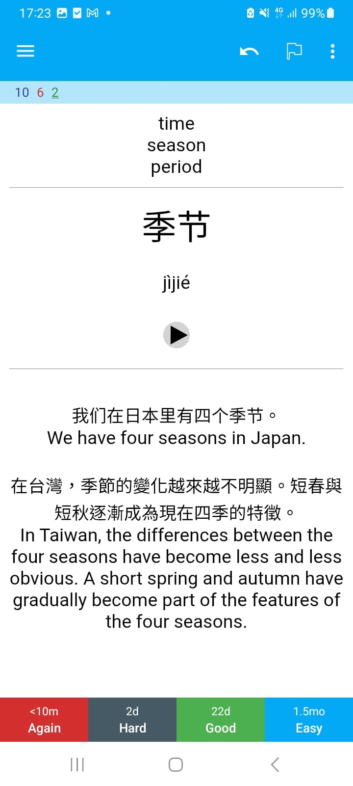

# Anki Card Generator for Chinese

This project was born out of a real need: while learning Chinese, I constantly noted down new words, but turning them into meaningful Anki cards was tedious. This tool automates that process—given a list of words, it generates ready-to-import Anki cards with rich context.

### Input (`input.txt`) and output
Screenshots below show how the tool transforms a simple text file into structured Anki cards.

```text
季节 吃饭 电脑 衬衫
```




## What it does

You write Chinese words in a plain text file. The script sends them to an LLM and outputs structured cards with example sentences and metadata into a CSV. You can import that directly into Anki.

## Fine tuning and why this is interesting

The most significant technical point isn’t the script itself, but what it demonstrates: the limits of prompt engineering and the value of fine-tuning a language model for a specific task.

When relying on base models, the quality of example sentences was too basic. Prompt tweaks didn’t help much. The only way to consistently generate useful, nuanced sentence batteries was to fine-tune the model with a curated dataset. Once fine-tuned, the improvement was immediate and consistent—cards became far more usable for language acquisition.

> The fine-tuning process was done separately and isn’t included in this repo, but this script is a working demonstration of the result.

## What this could become

This is not just a one-off solution—it’s the foundation for a larger product:
- A cross-platform app for generating language-learning cards on the fly
- A browser extension that adds words directly from articles
- An API that serves structured card data from fine-tuned models
- A community-curated sentence database tailored to learners' real needs

The core idea is validated. It works. It saves time. It’s immediately useful.

## Disclaimer

This is prototype code. Most of it was vibe coded to test the concept quickly. It’s not written with security or best practices in mind. You’ll see rough edges.


## Setup and usage

```bash
pip install openai tenacity
export OPENAI_API_KEY="sk-..."
```

Write your Chinese words into input.txt, separated by spaces.

```
python anki_card_generator.py
```

It will:

- Send each word to the OpenAI API

- Generate a JSON card

- Log raw results to output/raw_cards_log.txt

- Save formatted cards to output/cards.csv (ready for Anki import)

